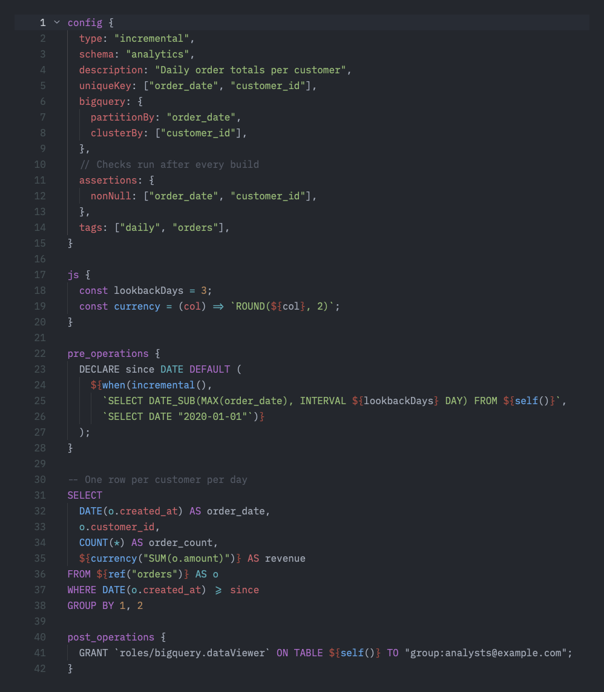

# Dataform SQLX for Zed

[Dataform](https://cloud.google.com/dataform) `.sqlx` support for the [Zed](https://zed.dev) editor.

Mapping `.sqlx` to plain SQL breaks highlighting, because the SQL parser treats every `config { ... }` block and `${ref(...)}` as a syntax error. This extension ships a small tree-sitter grammar that splits a `.sqlx` file into its parts and hands each part to the right language:

| Part | Highlighted as |
| --- | --- |
| SQL body, `pre_operations`, `post_operations`, `incremental_where`, `input "…"` | SQL (Zed's SQL extension) |
| `config { … }` | Keys natively, values as JavaScript |
| `js { … }` and `${ … }` | JavaScript |

## Features

- **Syntax highlighting** for SQL, JavaScript and Dataform blocks in one file.
- **Outline** (`cmd-shift-o`): jump to `config`, its keys, and each block.
- **Run buttons** on `config`: compile the project or run the current action with the [Dataform CLI](https://cloud.google.com/dataform/docs/use-dataform-cli).
- **Comment toggling** uses `--` in SQL and `//` inside `config` and `js`.
- **Auto-indent**, bracket matching, and auto-closing quotes aware of strings and comments.
- **Vim text objects**: `]]`/`[[` move between blocks, `ac`/`ic` select a block, `af`/`if` select a `${ … }` interpolation.

## Installation

This extension is not in the Zed extension registry yet. To install it from source:

1. Install the **SQL** extension from Zed's Extensions panel (`cmd-shift-x`). The SQL parts of `.sqlx` files are highlighted by it.
2. Clone this repository.
3. Run `zed: install dev extension` from the command palette and choose the cloned folder.
4. Open a `.sqlx` file. The status bar should show **Dataform SQLX**.

The first install takes about a minute while Zed downloads its WebAssembly toolchain and compiles the grammar.

> If `.sqlx` still opens as SQL, remove any `"file_types": { "SQL": ["sqlx"] }` entry from your Zed settings. User `file_types` take priority over extensions.

## Dataform tasks

Click the run button next to `config`, or run `task: spawn` from the command palette:

| Task | Command |
| --- | --- |
| `dataform compile` | `dataform compile <project>` |
| `dataform run <file> --dry-run` | Print the SQL for this action without running it |
| `dataform run <file>` | Run this action |
| `dataform run <file> --include-deps` | Run this action and its dependencies |

`<project>` is the nearest folder above the file that contains `workflow_settings.yaml` (or `dataform.json` for older projects). `<file>` is the file name without `.sqlx`, which is the action name unless `config` sets a different `name`. The tasks need the Dataform CLI (`npm i -g @dataform/cli`) and credentials configured for your project.

## Known limitations

- SQL around an interpolation is parsed with the interpolation removed, so `FROM ${ref("t")}` produces a small local parse error after `FROM`. Keywords are still highlighted.
- SQL highlighting is only as good as Zed's SQL grammar, which does not support some BigQuery syntax such as `SELECT * EXCEPT(...)`.

## Contributing

Bug reports and pull requests are welcome. See [CONTRIBUTING.md](CONTRIBUTING.md) for how the grammar and queries fit together and how to test changes.

## License

[MIT](LICENSE)
